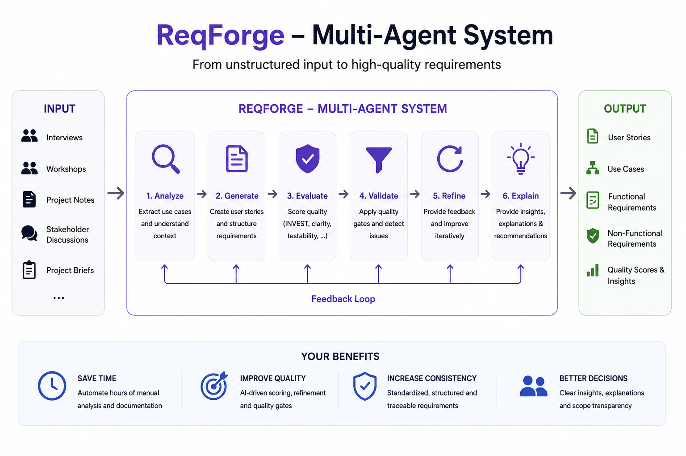
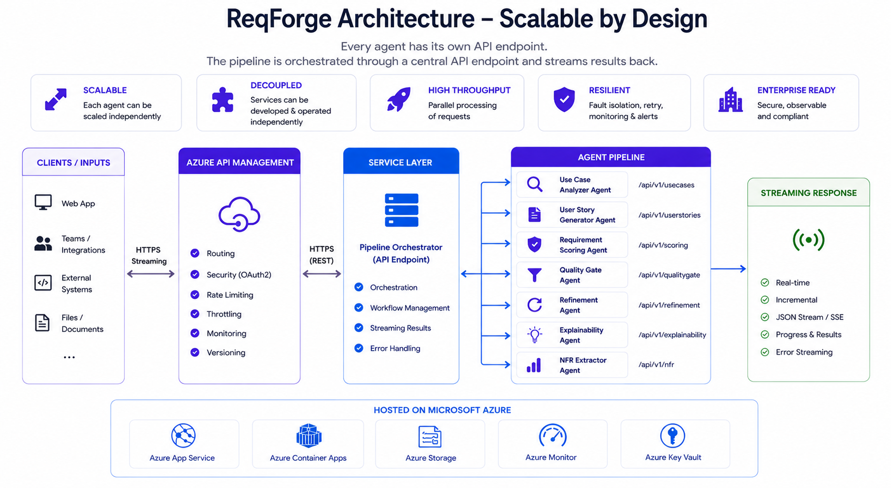
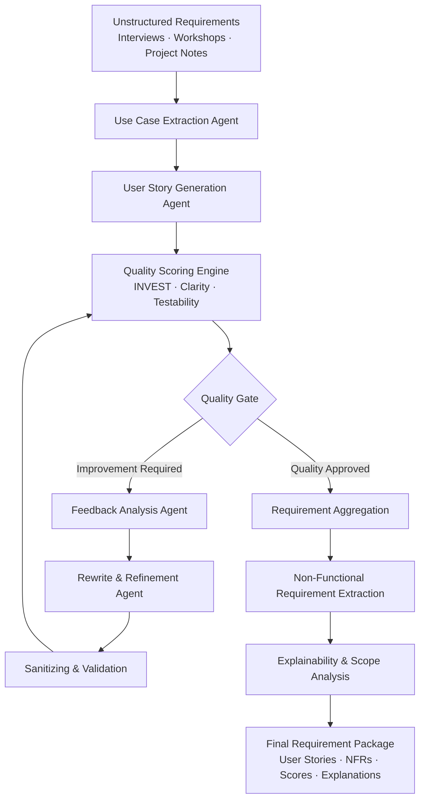

# Governance-first AI Requirements Engineering Agent

### Problem

Most AI coding tools assume that high-quality specifications already exist.

In reality, requirements are often scattered across workshop notes,
stakeholder interviews, emails, meeting transcripts and project documents.

The result:

- incomplete requirements
- inconsistent user stories
- missing non-functional requirements
- poor AI-generated implementations

ReqForge addresses this gap by transforming unstructured stakeholder
knowledge into structured, explainable and AI-ready specifications.

### Live Demo

ReqForge transforms unstructured workshop notes and requirements into structured, explainable, and governance-ready user stories.

✅ Explainable AI
✅ Human Oversight
✅ EU AI Act aligned
✅ Iterative Requirement Refinement
✅ Audit-ready Agent Workflows

## About 

ReqForge is an AI-powered requirements engineering agent designed to automatically analyze, structure, refine, and evaluate software requirements. The system transforms unstructured input such as interviews, workshop notes, stakeholder discussions, and project briefs into high-quality user stories, use cases, and functional as well as non-functional requirements.

Rather than relying on a single prompt, ReqForge uses a multi-stage agent architecture with iterative quality improvement, scoring mechanisms, refinement loops, and explainable outputs.

## Features

- Automatic extraction of use cases from unstructured requirements
- AI-generated user stories following INVEST principles
- Iterative quality improvement through feedback and rewrite loops
- Quality gates for filtering weak or ambiguous requirements
- Automatic extraction of functional and non-functional requirements
- Scoring engine for clarity, consistency, testability, and estimability
- Explainability layer for requirement quality and scoring decisions
- Detection of implicit requirements and domain-driven insights
- Modular node-based agent workflow architecture

---

## Architecture

ReqForge is built around an orchestrated multi-agent workflow pipeline:

1. Use Case Extraction  
2. User Story Generation  
3. INVEST-Based Scoring  
4. Quality Gate Evaluation  
5. Feedback Analysis  
6. Rewrite & Refinement  
7. Requirement Aggregation  
8. Non-Functional Requirement Extraction  
9. Scope & Explainability Analysis  

Each processing stage is isolated, explainable, and iteratively improvable.

---

## Agent Flow Architecture

---

## Example Output

ReqForge can automatically generate:

- prioritized user stories
- structured acceptance criteria
- requirement quality metrics
- security, compliance, and performance requirements
- refinement suggestions
- explainable stakeholder-ready documentation

from raw interview notes or workshop input.

---

## Goal

ReqForge is designed to support:

- Product Owners
- Business Analysts
- Software Architects
- Agile Teams
- Requirements Engineers

in creating structured, consistent, and high-quality software requirements.

The platform reduces manual analysis effort, improves requirement consistency, and creates a transparent foundation for planning, development, and stakeholder communication.

---

## Tech Stack

- Python
- LLM-based agent architecture
- Node-based workflow orchestration
- JSON-based requirement pipelines
- INVEST-based quality scoring
- Iterative feedback and refinement loops

---

## Vision

ReqForge is evolving into an intelligent semantic requirements engineering platform focused on:

- traceability
- consistency analysis
- automatic requirement refinement
- semantic domain modeling
- dependency and impact analysis
- AI-assisted software specification generation

---

## Status

Current development status:

- functional end-to-end agent pipeline
- iterative quality refinement
- automatic NFR extraction
- explainability system
- experimental requirement scoring engine

ReqForge is actively under development.
